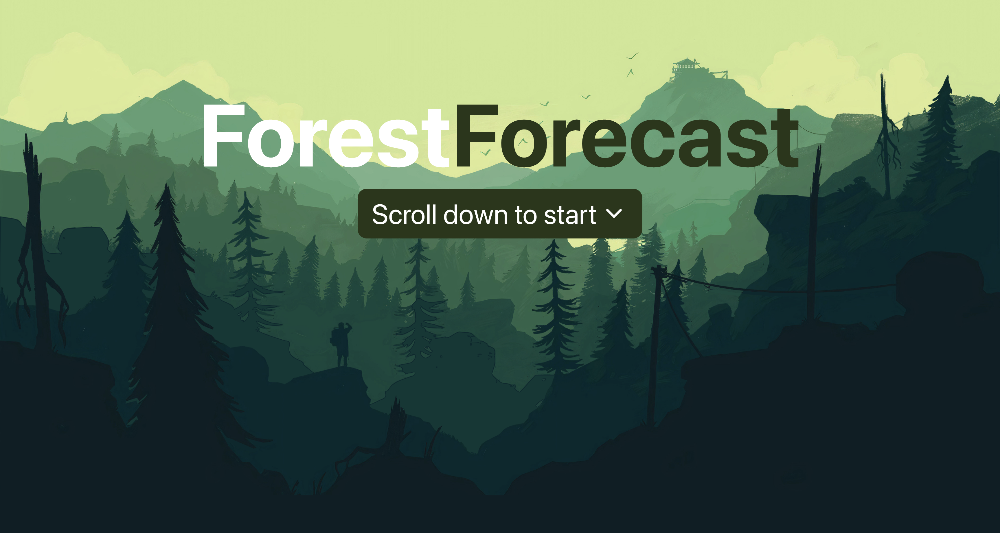
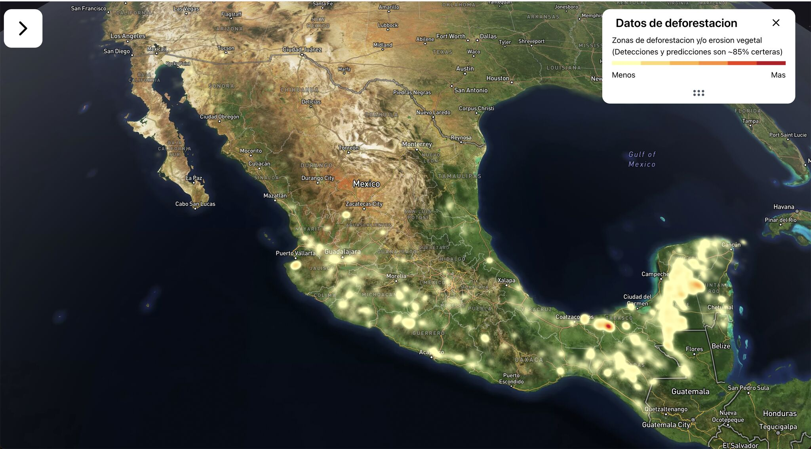

# ForestForecast: See the Forest for the Trees - Deforestation Prediction Platform

Dynamic web application to visualize deforestation risks using interactive 3D mapping technologies. By integrating historical satellite and geographical data into our frontend, we aim to provide an intuitive and visually engaging experience that helps in identifying areas at risk of deforestation, thereby aiding more effective conservation efforts.

## Overview

ForestForecast aims to empower stakeholders with real-time, data-driven insights by visualizing vulnerable areas through an interactive map on our website, forestforecast.lat. This tool is designed to enhance the effectiveness of conservation efforts by providing a user-friendly interface to explore different regions and understand their risk levels.

## About Us
Located in Jalisco, Mexico, our project, ForestForecast, tackles the global challenge of deforestation—caused by agriculture, logging, and urban expansion. Our platform is user-friendly and designed to provide crucial insights not just locally, but around the world. We aim to empower environmental agencies, local authorities, and the general public by offering real-time data on a 3D map. This map not only pinpoints areas at high risk of deforestation but also shows alerts that have been issued.

Our objective is to leverage the power of modern web technologies to create an accessible, informative, and engaging platform that facilitates rapid response and informed decision-making for conservation efforts globally. We are committed to using our technological expertise to support sustainable environmental practices and help preserve natural habitats worldwide.

## Application Workflow

1. **Data Integration**
     - **Satellite Imagery**: Utilize imagery from NASA and Google Earth Engine.
      - **Data Preparation**: Process and prepare data for use in the machine learning model.
     
2. **Machine Learning Model**
   - **Model Training**: Train the model using collected satellite imagery to predict deforestation risks.
   - **Accuracy and Testing**: Achieve approximately 85% accuracy, testing and refining the model to enhance its predictive power.

3. **User Interface Design**
   - **Interactive 3D Maps**: Utilize Mapbox and Deck.gl to create immersive, interactive maps.
   - **Responsive Design**: Implement TailwindCSS for a responsive, mobile-first design approach.

4. **Frontend Development**
   - **React Framework**: Build the application using React for efficient, component-based development.
   - **State Management**: Use React context or state management libraries to handle data across components.

5. **Performance Optimization**
   - **SWC for Compilation**: Employ SWC to compile TypeScript for faster development builds and efficient production deployment.
   - **Vite as Build Tool**: Use Vite for bundling; it offers out-of-the-box support for React and TypeScript, enhancing developer experience and application performance.

6. **Deployment**
   - **Scalable Hosting**: Deploy the application on scalable cloud services to handle varying loads.

## Technologies Used

- **Typescript**: For strong typing and maintainable code structure.
- **Vite**: Utilized for fast builds and hot module replacement.
- **React**: For building the user interface in a modular, maintainable way.
- **SWC**: Used as the JavaScript/TypeScript compiler for faster compilation times.
- **TailwindCSS**: For styling and building a responsive design.
- **Mapbox**: For rendering interactive 2D and 3D maps.
- **Deck.gl**: For visualizing large datasets on the map with WebGL overlays.

### Backend
The backend, which handles data processing and server interactions, is powered by:
- **Python**: A versatile programming language that supports rapid development.
- **Flask**: A lightweight framework that offers flexibility in building web applications.
- **AWS**: Ensures scalable and reliable hosting, capable of managing high traffic and data loads.

### Machine Learning Model
Our machine learning model, which predicts areas at risk of deforestation, utilizes:
- **Python**: For scripting and automation.
- **Pandas & Numpy**: Essential libraries for data manipulation and numerical calculations.
- **Scikit-learn & Keras**: Provide tools for machine learning model development, training, and evaluation.
- **Seaborn & Matplotlib**: Used for data visualization, helping to analyze and interpret complex datasets.

## Setup Instructions

Before running the application, ensure you have Node.js installed. Follow these steps to set up your environment:

1. **Install Node.js**
   - Download from [Node.js's official site](https://nodejs.org).

2. **Clone the Repository**
   - Use Git to clone the project repository: `git clone https://github.com/FerretScript/ForestForecast`

3. **Install Dependencies**
   - Navigate to your project directory: `cd ForestForecast`
   - Install dependencies: `pnpm install`

4. **Run the Application**
   - Start the development server: `pnpm run dev`
   - Open your browser and navigate to `http://localhost:3000`

## Important Considerations
- **Data Quality**: High-quality, up-to-date satellite data is essential for accurate predictions.
- **User Accessibility**: The interface should be intuitive and easy to navigate for all users.
- **Scalability**: Ensure the platform can handle increased traffic and data as user engagement grows.

## Links
- **Backend Repository**: [Backend Repo](https://github.com/FerretScript/ForestForecastBE)
- **Machine Learning Model Repository**: [ML Model Repo](https://github.com/FerretScript/ForestForecastML)